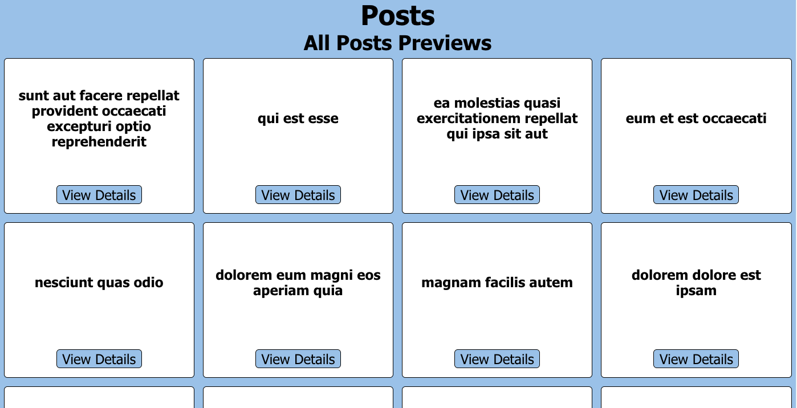
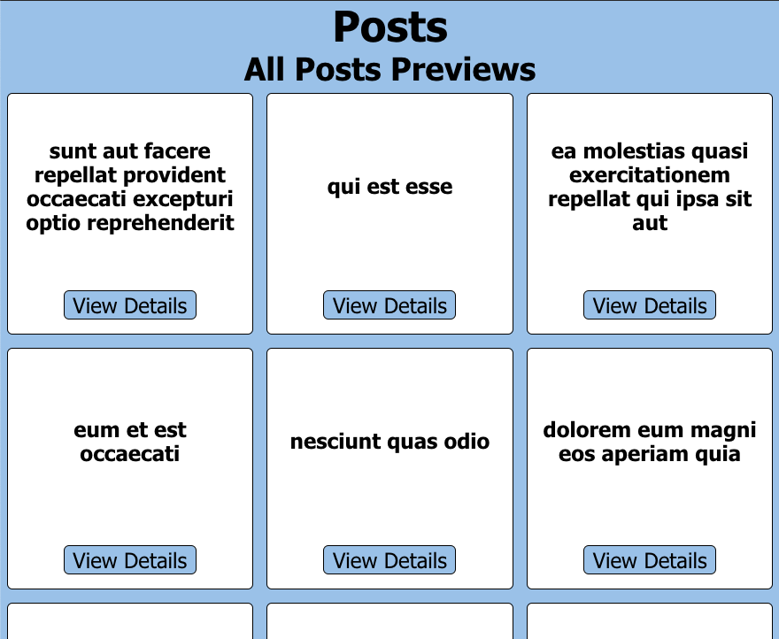
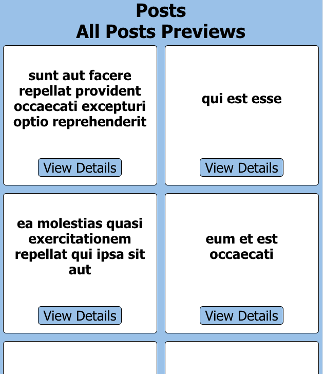
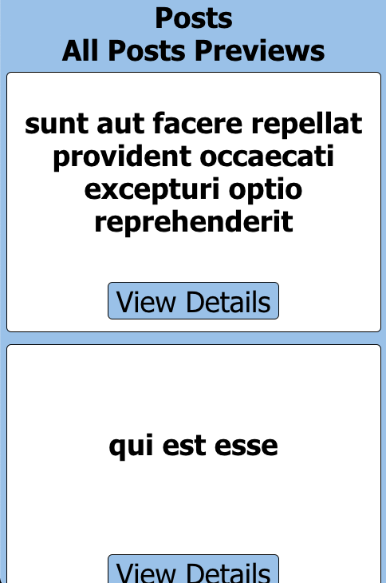
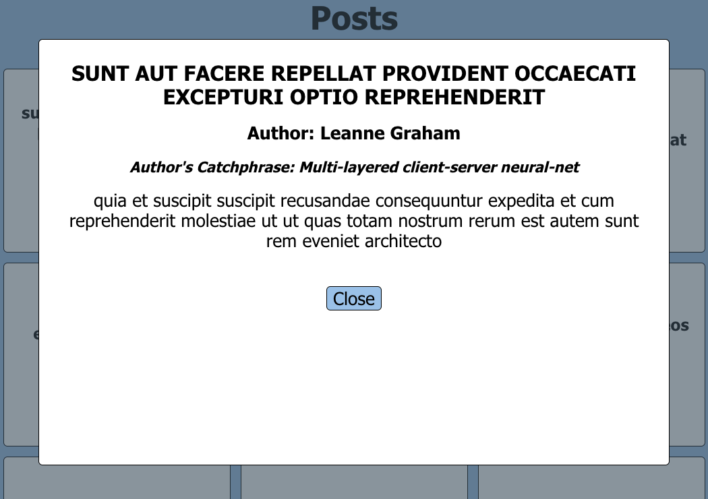
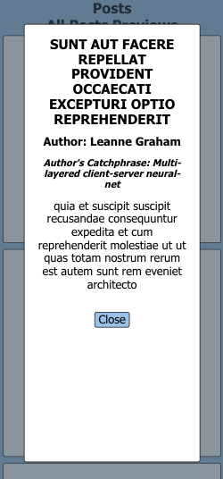

# Pride Places Code Challenge

## Table of Contents
* [Description](#description)
* [Installation](#installation)
* [Walkthrough](#walkthrough)
* [Author](#author)
* [Technologies](#technologies)

## Description
This project was a take home code challenge for an internship at Pride Places. It required use of React, vanilla js, or Next.js to build a front end app to display post titles from a given API. When any post title is clicked, a modal opens up to display the author's name, author's catchPhrase, post title, post body, and a close button. The modal's close button closes the modal and clicking outside of the modal also closes the modal.

### Notable features
 - Responsive design for a user-friendly experience on a variety of screen-sizes
 - 100% Lighthouse Accessibility audit
 - 100% Lighthouse Best Practices audit
 - 100% Lighthouse SEO audit

### Deploy Link
pride-places-code-challenge.surge.sh

## Installation
1. Clone down this [repo](https://github.com/RMartin0717/pride-places-coding-challenge)
2. CD into project directory
3. Run npm i to install all project dependencies
4. Run npm start to begin the server
5. Application should be shown in separate window once npm start is complete

## Walkthrough

 - When the user arrives on the page, a page heading is visiable as well as a display featuring cards containing post titles
 - When a user clicks on any post title card, a modal pops up over the main content of the page and details for the post are displayed
 - When the user clicks the close button or outside of the modal, the modal closes

Desktop Home Page

Tablet Page

Mobile Home Page

Desktop Post Modal

Mobile Post Modal

## Author
<table>
    <tr>
        <td> Riley Martin <a href="https://github.com/RMartin0717">GH</td>
    </tr>
    </tr>
        <td></td>
    </tr>
</table>

## Technologies
<table>
    <tr>
        <td>Framework</td>
        <td>Functionality</td>
        <td>Structure</td>
        <td>Styling</td>
    </tr>
    </tr>
      <td></td>
      <td></td>
      <td></td>
      <td></td>
    </tr>
</table>
